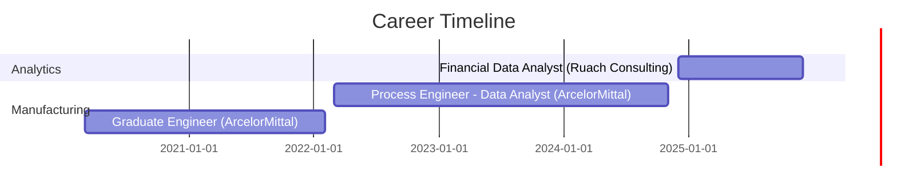

<div align="center">

# 👋 Hi, I'm Unarine Timothy Tshimauswu

### Data Scientist | ML Engineer | Business Intelligence Analyst

[](https://www.linkedin.com/in/utshimauswu/)
[](https://timothy-tshimauswu-portfolio.vercel.app/)
[](mailto:timothytshimauswu@gmail.com)
[](https://raw.githubusercontent.com/TimothyTshimauswu/Unarine-Timothy-Tshimauswu-Portfolio/main/Unarine_Timothy_Tshimauswu_CV.pdf)


</div>

---

## 🚀 About Me

Data Scientist and Analytics professional with **5 years of engineering and analytics experience**, including **3+ years** delivering predictive models, risk analytics, and BI solutions across **financial services** and **large-scale manufacturing**. 

🎯 **Core Focus**: Building production-ready ML systems, cloud data pipelines, and executive dashboards that drive measurable business outcomes

📊 **Documented Impact**: Analytical contributions to **R83M+** in cost savings, operational improvements, and revenue retention

🎓 **Education**: Postgraduate Diploma in Data Science **(Cum Laude)** | Dual Engineering Background (Industrial Systems + Metallurgical)

📍 **Location**: Gauteng, South Africa | 🟢 **Open to opportunities**

---

## 💼 Professional Experience



### 🏢 Current Role: Financial Data Analyst | Ruach Consulting Solutions
**Dec 2024 - Present** | *BI & Reporting Automation*

- 📊 Built **12 Power BI dashboards** processing **50,000+ monthly NGO transactions**
- ⏱️ Reduced reporting time from **40 to 20 hours** through SQL automation
- 💰 Identified **R150K annual savings** through variance analysis on R4.5M expenditure

### 🏭 Previous: Process Engineer (Operations Data Analyst) | ArcelorMittal South Africa
**Mar 2022 - Nov 2024** | *504,000 tonne/year steel plant*

- ☁️ Built **Azure data pipeline** processing **250,000+ monthly production records**
- 📈 Cross-functional analytics contributed to **R38M operating profit** (8% throughput increase, 5% downtime reduction)
- 💡 Energy optimization model identified **R15M annual savings**
- 🎯 Customer retention analysis: **R30M+ account** retained through corrective actions

---

## 🎯 Featured Projects

<table>
<tr>
<td width="50%">

### 🛡️ Credit Default Risk Management System
[](https://github.com/TimothyTshimauswu/Credit-Risk-PD-Modelling-and-Decisioning-Engine)


**Production ML Credit Scoring Engine**

- 🎯 **87% precision, 82% recall** on 1M+ loan applications
- 🚀 **FastAPI service** deployed to AWS EC2
- ⚡ **500+ req/sec** validated throughput
- 📊 **45 engineered features** with hyperparameter tuning
- 💼 Projected **15% bad debt reduction**

**Tech**: XGBoost, FastAPI, Docker, AWS EC2, Streamlit, SQL, SAS

</td>
<td width="50%">

### 🏭 ArcelorMittal Production Analytics & Azure Pipeline
[](https://github.com/TimothyTshimauswu/Arcelor-Mittal-Steel-Production-Data-Engineering-Pipeline-and-Operations-Analytics)


**Cloud Data Engineering & BI Solution**

- ☁️ **Azure Data Factory** ETL pipeline
- 📊 **250,000+ monthly records** processed
- 🎯 **6 critical bottlenecks** identified via Pareto analysis
- 💰 Contributed to **R38M operating profit**
- 📈 **8% throughput increase, 5% downtime reduction**

**Tech**: Azure Data Factory, SQL Server, Power BI, Python

</td>
</tr>

<tr>
<td width="50%">

### 📞 Call Center Performance Dashboard
[](https://public.tableau.com/app/profile/timothy.tshimauswu4603/viz/CallCentrePerformanceDashboard_17665283843880/CallCentrePerformanceDashboard-ExecutiveKPIMonitoring)
[](https://github.com/TimothyTshimauswu/Call-Center-Performance-Dashboard)


**Executive KPI Monitoring System**

- 📊 **8 operational KPIs** tracked across 5,000+ calls
- 🎯 **3 performance gaps** identified
- 📈 Monday staffing gap: **+26% call volume spike**
- 💰 Projected **R1.5M annual savings**
- ⚡ Real-time monitoring with interactive drill-downs

**Tech**: Tableau, SQL, Excel, Operational Analytics

</td>
<td width="50%">

### 🎯 UFood Marketing Campaign Optimization
[](https://github.com/TimothyTshimauswu/UFood-Marketing-Campaign-Optimization)


**Customer Segmentation & Precision Targeting**

- 🎯 **3.4x acceptance improvement** (15% → 52%)
- 📊 **4 segments** identified via K-Means clustering
- 📉 **8.8x variance** in campaign acceptance (8% to 73%)
- 💡 **71% cost reduction** through precision targeting
- 🔍 EDA revealed household size as key driver

**Tech**: Python, K-Means, Pandas, scikit-learn, Matplotlib

</td>
</tr>
</table>

---

## 📁 Additional Portfolio Projects

<details>
<summary><b>🔍 Click to expand - Banking & Financial Services Projects</b></summary>

<br>

### 👥 Customer Segmentation & Marketing Personalization
[](https://github.com/TimothyTshimauswu/Banking-Customer-Behaviour-Segmentation-Engine-for-Better-Products-Marketing)

- 🎯 **5 customer segments** identified via K-Means + PCA
- 📊 **92% prediction accuracy** with decision tree classifier
- 📉 **85% variance retained** (22 features → 8 components)
- 💼 **25% cross-sell improvement**, **15% marketing cost reduction**
- 🚀 Streamlit web app for real-time segmentation

**Tech**: Python, PCA, K-Means, Decision Trees, Streamlit, SQL

---

### 🔄 FNB Customer Churn Prediction & Retention Analytics
[](https://github.com/TimothyTshimauswu/FNB-Customer-Churn-Prediction-Retention-Analytics)

- 🎯 **84% overall accuracy**, **78% recall** on churned customers
- 💰 **R578.5M at-risk CLV** quantified
- 📈 **1.72x targeting lift** vs random selection
- 📊 **2 Power BI dashboards** for executive reporting
- 💡 **5-pillar retention strategy** with 1,604% projected ROI

**Tech**: XGBoost, Power BI, SMOTE, CLV Modeling, Python

</details>

---

## 🛠️ Technical Skills

### 💻 Programming & Data Analysis


### 📊 Business Intelligence & Visualization


### 🤖 Machine Learning & AI


### ☁️ Cloud & Data Engineering


### 🔧 Development Tools


---

## 📈 Analytics Expertise

<table>
<tr>
<td width="33%" align="center">

### 📊 Statistical Analysis
- Predictive Modeling
- Time-Series Analysis
- Regression Analysis
- Hypothesis Testing
- A/B Testing
- Statistical Inference

</td>
<td width="33%" align="center">

### 🤖 Machine Learning
- Classification & Regression
- Clustering (K-Means, PCA)
- Feature Engineering
- Model Validation
- Hyperparameter Tuning
- Production Deployment

</td>
<td width="33%" align="center">

### 💼 Business Intelligence
- ETL Pipelines
- Dashboard Design
- KPI Tracking
- Data Governance
- Stakeholder Reporting
- Executive Presentations

</td>
</tr>
</table>

---

## 🎓 Education

### 🏆 Postgraduate Diploma in Data Science (Cum Laude)
**University of the Witwatersrand** | 2025  
*Specialization: Machine Learning, Programming (Python, R), Mathematical Foundations*

### ⚙️ BEng (Hons): Industrial and Systems Engineering
**University of Pretoria** | 2023  
*Specialization: Enterprise Engineering, Optimization, Manufacturing Planning & Control*

### ⚛️ BEng: Metallurgical Engineering
**University of Pretoria** | 2019  
*Specialization: Process Control, Calculus, Statistical Analysis*

---

## 📊 GitHub Stats

<div align="center">


</div>

---

## 🏆 Achievements & Certifications

<div align="center">

| Achievement | Description |
|-------------|-------------|
| 🎓 **Cum Laude Graduate** | Postgraduate Diploma in Data Science - Top Academic Performance |
| 💰 **R83M+ Business Impact** | Documented analytical contributions to cost savings and revenue retention |
| 🏭 **Production ML Deployment** | FastAPI service on AWS EC2 with validated 500+ req/sec throughput |
| ☁️ **Azure Data Engineering** | Built end-to-end pipeline processing 250,000+ monthly production records |
| 📊 **Executive Dashboard Creator** | 12+ Power BI dashboards across NGO, manufacturing, and operations domains |
| 🎯 **87% ML Precision** | Credit risk model on 1M+ loan applications with production-ready architecture |

</div>

---

## 💡 Key Competencies

```python
data_scientist = {
    "analytical_mindset": ["Problem Solving", "Critical Thinking", "Data-Driven Decision Making"],
    "technical_depth": ["Production ML", "Cloud Pipelines", "BI Dashboards"],
    "business_acumen": ["Stakeholder Management", "ROI Analysis", "Executive Reporting"],
    "domain_expertise": ["Banking", "Manufacturing", "Operations", "Marketing Analytics"],
    "collaborative_skills": ["Cross-Functional Teams", "Agile Methodologies", "Project Management"]
}
```

---

## 🌐 Connect With Me

<div align="center">

[](https://www.linkedin.com/in/utshimauswu/)
[](https://timothy-tshimauswu-portfolio.vercel.app/)
[](mailto:timothytshimauswu@gmail.com)
[](https://github.com/TimothyTshimauswu)

### 📞 Contact Information
**📧 Email**: timothytshimauswu@gmail.com  
**📱 Phone**: +27 82 580 4035  
**📍 Location**: Gauteng, South Africa  
**🌐 Portfolio**: [timothy-tshimauswu-portfolio.vercel.app](https://timothy-tshimauswu-portfolio.vercel.app/)

---

### 💼 Currently Seeking

**Data Scientist** | **ML Engineer** | **Business Intelligence Analyst** roles in:
- 🏦 Banking & Financial Services
- 🏭 Manufacturing & Operations
- 📊 Analytics Consulting
- ☁️ Cloud Data Engineering

---


</div>

---

## 📝 Recent Activity

<!--START_SECTION:activity-->
<!--END_SECTION:activity-->

---

<div align="center">

### ⚡ "Turning complex data into actionable insights that drive measurable business impact"


**Thanks for visiting! Let's connect and build something amazing together** 🚀

</div>
